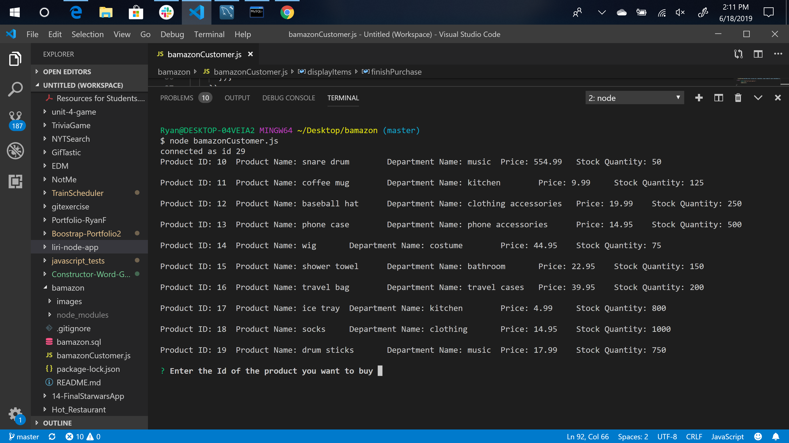
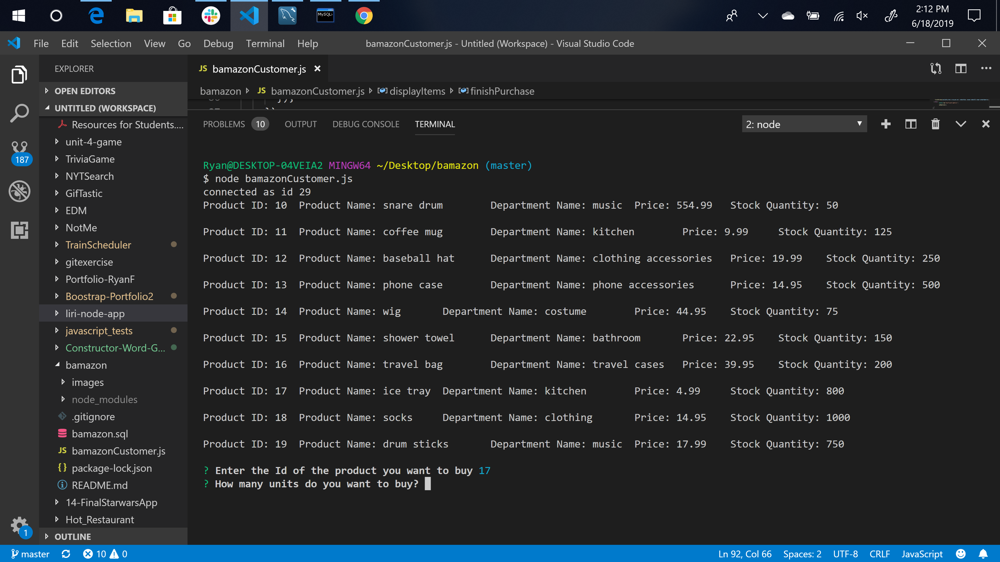
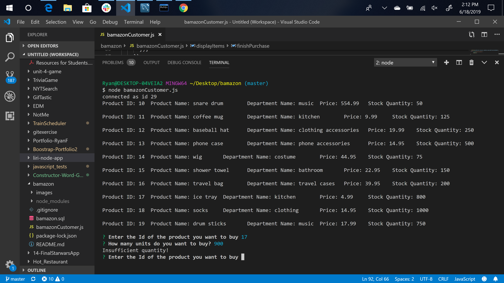
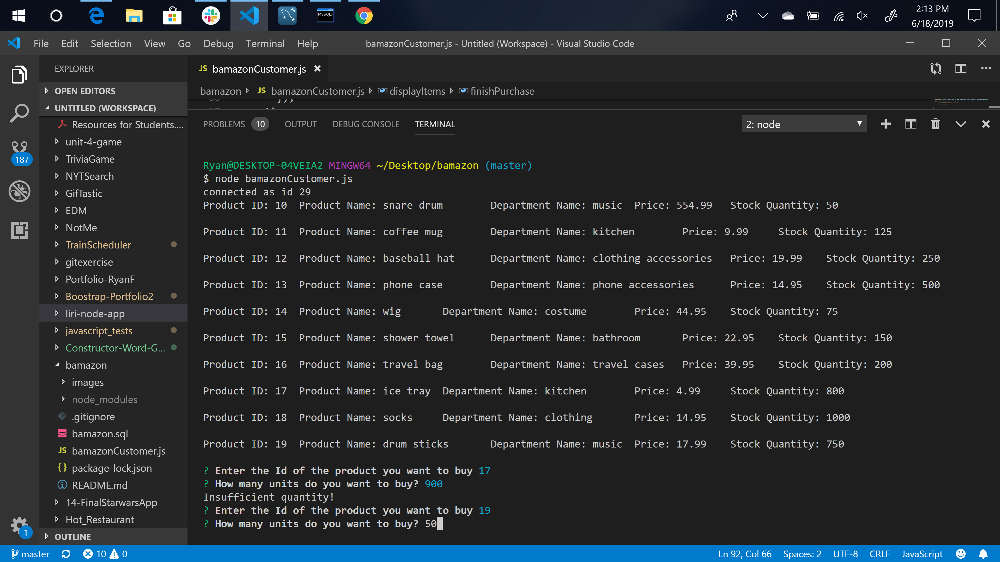
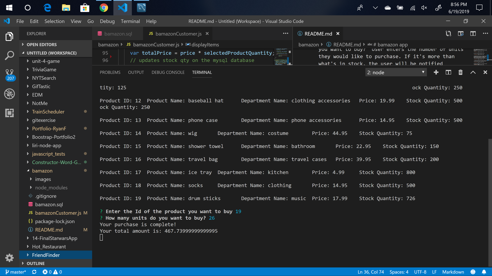

# bamazon app
Week-12 Node.js and MySQL Assignment 

The Bamazon app will take in orders from customers and deplete stock from the store's inventory.

How to Start:

    1. Clone the repo. 
    2. Run command npm install in GitBash or Terminal. 
    3. Run command node bamazonCustomer.js

Running bamazonCustomer.js will display all of the items available for sale followed
by a question 'Enter the ID of the product you want to buy' 

User enters the product ID# and hits enter 

A second question asks the user 'How many units do you want to buy?' User enters the number of units they would like to purchase. If it's more than what's in stock, the user will be notified 'Insufficient Quantity! and then the prompts reset.

...and then the prompts reset and you can enter the Id and qty again or shop for something different.

user enters the ID and qty of the product they want to buy and it returns a message 'Your purchase is complete!' and it displays 'Your total amounts is: + totalPrice'

Tech Used: 

    1. Node.js 
    2. MySQL Workbench 
    3. Node_Modules: inquirer, mysql 

Built With: 

    VS Code 

Authors: 

    Ryan Fogle 
